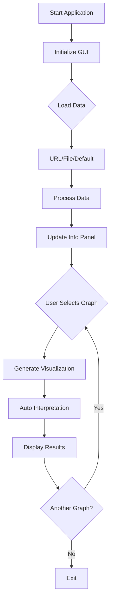

# 📊 Data Graph Explorer

<div align="center">


**Explorasi dan Visualisasi Data Interaktif - Project Pelatihan FreeCodeCamp**

[Fitur](#-fitur) • [Instalasi](#-instalasi) • [Penggunaan](#-penggunaan) • [Dokumentasi](#-dokumentasi)

</div>

## 📋 Daftar Isi

- [Gambaran Umum](#-gambaran-umum)
- [Fitur](#-fitur)
- [Instalasi](#-instalasi)
- [Penggunaan](#-penggunaan)
- [Dokumentasi](#-dokumentasi)
- [Contoh Penggunaan](#-contoh-penggunaan)
- [FAQ](#-faq)

## 🚀 Gambaran Umum

**Data Graph Explorer** adalah aplikasi visualisasi data interaktif yang dibangun dengan Python dan Matplotlib. Aplikasi ini dikembangkan sebagai bagian dari pelatihan FreeCodeCamp dan menyediakan antarmuka grafis yang powerful untuk mengeksplorasi, menganalisis, dan memvisualisasikan dataset dengan berbagai jenis grafik.

### ✨ Highlights

- 🎨 **GUI Interaktif** - Antarmuka matplotlib dengan kontrol real-time
- 📈 **Multiple Graph Types** - Scatter, line, histogram, dan bar charts
- 🌐 **Multiple Data Sources** - URL, file lokal, dan dataset default
- 🔍 **Auto-Interpretation** - Interpretasi otomatis hasil visualisasi
- 📊 **Data Insights** - Informasi dataset dan statistik dasar
- 🛡️ **Error Handling** - Penanganan error yang robust
- 🎓 **Educational Purpose** - Cocok untuk pembelajaran data science

## 🌟 Fitur

### 🤖 Core Features
- **Visualisasi Data Real-time** - Grafik yang diperbarui secara instan
- **Multiple Chart Types** - Empat jenis visualisasi berbeda
- **Interactive Controls** - Radio buttons, dropdowns, dan input fields
- **Auto Column Detection** - Deteksi otomatis kolom numerik dan kategorikal

### 🛠️ Utility Features
- **🌐 Load from URL** - Muat data langsung dari URL CSV
- **📁 Upload CSV** - Unggah file CSV lokal
- **🎯 Default Dataset** - Dataset iris bawaan untuk quick start
- **📈 Graph Customization** - Pilih sumbu X dan Y secara fleksibel
- **📋 Data Information** - Panel info dataset lengkap

### 💾 Data Management
- **Auto Data Validation** - Validasi tipe data otomatis
- **Missing Value Handling** - Penanganan nilai kosong yang aman
- **Column Type Detection** - Deteksi otomatis numerik vs kategorikal
- **Data Statistics** - Informasi shape dan tipe data

### 🎨 GUI Features
- **Clean Layout** - Tata letak yang terorganisir dan intuitif
- **Real-time Updates** - Grafik diperbarui secara real-time
- **Interactive Widgets** - Button, radio buttons, dan text box
- **Professional Styling** - Grafik dengan grid dan label yang jelas

## 📥 Instalasi

### Prerequisites

- Python 3.7 atau lebih tinggi
- Libraries: pandas, numpy, matplotlib, tkinter

### Step-by-Step Installation

1. **Install Dependencies**
   ```bash
   pip install pandas numpy matplotlib
   ```

2. **Download Script**
   ```bash
   # Save sebagai: data_graph_explorer.py
   ```

3. **Verifikasi Dependencies**
   ```bash
   python -c "import pandas, numpy, matplotlib, tkinter; print('Dependencies OK')"
   ```

4. **Run Application**
   ```bash
   python data_graph_explorer.py
   ```

### Quick Install
```bash
# Langsung jalankan file
python data_graph_explorer.py
```

## 🎮 Penggunaan

### Menjalankan Aplikasi

```bash
python data_graph_explorer.py
```

### Basic Usage

1. **Memuat Data**
   - Klik "Load Default" untuk dataset iris bawaan
   - Atau "Upload CSV" untuk file lokal
   - Atau "Load from URL" untuk data online

2. **Memilih Jenis Grafik**
   - Pilih antara: scatter, line, histogram, atau bar chart
   - Gunakan radio buttons di panel kanan

3. **Memilih Kolom**
   - Klik "Select X-axis" untuk memilih kolom sumbu X
   - Klik "Select Y-axis" untuk memilih kolom sumbu Y (jika diperlukan)

4. **Generate Grafik**
   - Klik "Generate Graph" untuk membuat visualisasi
   - Lihat interpretasi otomatis di bagian bawah

### Data Sources Support

| Source | Format | Example |
|--------|--------|---------|
| **URL** | CSV online | `https://raw.githubusercontent.com/mwaskom/seaborn-data/master/iris.csv` |
| **Local File** | CSV file | `data.csv` |
| **Default Data** | Built-in dataset | Iris dataset |

### Graph Types

| Type | Requirements | Best For |
|------|--------------|----------|
| **Scatter Plot** | X (numeric), Y (numeric) | Korelasi antara dua variabel |
| **Line Graph** | X (any), Y (numeric) | Tren over time/categories |
| **Histogram** | X (numeric) | Distribusi satu variabel |
| **Bar Chart** | X (categorical) | Perbandingan kategori |

## 📚 Dokumentasi

### Workflow Diagram



### Visualization Algorithms

**Scatter Plot:**
```python
correlation = x_data.corr(y_data)
interpretation = f"Correlation: {correlation:.3f}"
```

**Histogram:**
```python
bins = 20  # Optimal bin count
distribution_analysis = "Shows data distribution"
```

**Bar Chart:**
```python
if categorical: value_counts()
else: groupby().mean()  # Automatic grouping
```

## 💡 Contoh Penggunaan

### Contoh 1: Scatter Plot Analysis
```
📊 Data Loaded: Iris Dataset (150 rows, 5 columns)

Graph Type: Scatter
X-axis: sepal_length
Y-axis: petal_length

📊 Interpretation: Scatter plot: sepal_length vs petal_length, Correlation: 0.872
```

### Contoh 2: Histogram Distribution
```
📊 Data Loaded: Iris Dataset (150 rows, 5 columns)

Graph Type: Histogram  
X-axis: sepal_width

📊 Interpretation: Histogram of sepal_width: Shows data distribution
```

### Contoh 3: Bar Chart Comparison
```
📊 Data Loaded: Iris Dataset (150 rows, 5 columns)

Graph Type: Bar
X-axis: species
Y-axis: sepal_length

📊 Interpretation: Grouped bar chart: sepal_length by species
```

### Contoh 4: Line Graph Trends
```
📊 Data Loaded: Sales Data (365 rows, 3 columns)

Graph Type: Line
X-axis: date
Y-axis: revenue

📊 Interpretation: Line graph: revenue over date
```

## ❓ FAQ

### Q: Apakah perlu install library tambahan?
**A:** Hanya pandas, numpy, dan matplotlib. Tkinter sudah termasuk dalam Python standard library.

### Q: Format file apa yang didukung?
**A:** Saat ini hanya CSV files.

### Q: Bagaimana cara memilih kolom yang tepat?
**A:** Untuk scatter plot: pilih dua kolom numerik. Untuk histogram: satu kolom numerik. Untuk bar chart: kolom kategorikal.

### Q: Apa dataset default yang disediakan?
**A:** Iris dataset dari seaborn - dataset klasifikasi machine learning dengan 150 sample bunga iris.

### Q: Bisakah menyimpan grafik yang dibuat?
**A:** Belum tersedia.

### Q: Apa yang dilakukan fitur auto-interpretation?
**A:** Menganalisis grafik dan memberikan insight sederhana seperti korelasi untuk scatter plot.

### Q: Bagaimana menangani dataset yang sangat besar?
**A:** Aplikasi ini optimal untuk dataset kecil-medium. Untuk dataset besar, consider sampling atau optimization.

### Q: Apakah bisa menangani data time series?
**A:** Ya, gunakan line graph dengan kolom tanggal sebagai X-axis dan nilai numerik sebagai Y-axis.

---

<div align="center">

*"The goal is to turn data into information, and information into insight." - Carly Fiorina*

</div>

---

<div align="center">

**⭐ Jika project ini membantu, beri bintang! ⭐**

</div>